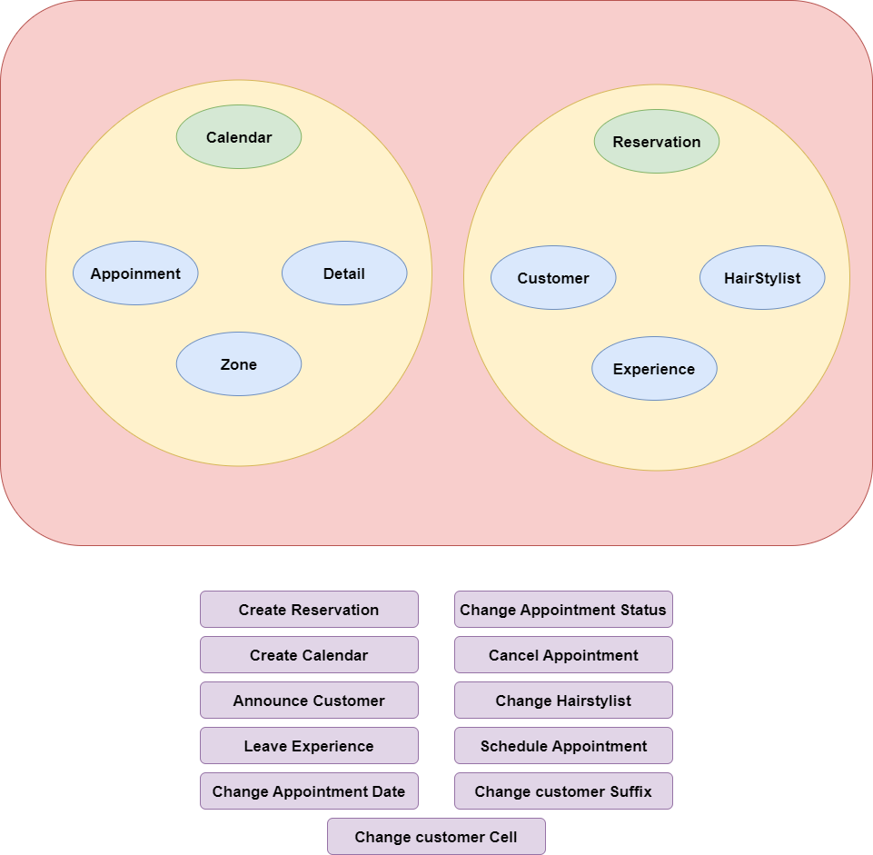

# Sofka U - Domain Driven Design Final Challenge

## Hair Lab Salon - reservation-app

## Description
This solution was developed using Domain Driven Design (DDD), which focuses on developing an ubiquitous language and efficiently managing the resources in the business solution in collaboration with a domain expert.

The main purpose of this reservation app is to provide the user and the hair salon with an easy way to manage reservations for any kind of service that the salon offers to its customers.

 

## Big Picture

The image below shows the domain and the specific subdomains as well. In this case, I chose the Reception subdomain as the core because I think the experience that you have when you go to a hair salon is determinant of whether you keep the service or leave for another. Therefore, I implemented the reservation-app that belongs to the reception problem space (a subdomain), and I also proposed different solution spaces (bounded contexts) for the other subdomains.

 

## Bounded Context and Ubiquitous Language

In the following image, you can see the solution space that I chose (bounded context). Here are the six entities related to the aggregate roots (Calendar and Reservation) that I used to implement the solution, as well as all the ubiquitous language related to this solution.

 

## Domain Model

This final diagram shows the detailed domain model, where all the entities are related to their respective aggregae roots as well as their own behaviors and value objects. You can see that the relationship between the reservation aggregate root and the calendar aggregate root is a customer-supplier relationship because the reservation aggregate provides information to the calendar aggregate.

 

## Command Driven Use Cases

Calendar aggregate:

* AnnounceCustomerUseCase - This use case update "customerArrived" property that means that the customer has arrived to the appointment.
* CancelAppointmentUseCase - This use case remove an appointment from the calendar.
* ChangeAppointmentDateUseCase - This use case change the appointment date.
* CreateCalendarUseCase - This use case creates an empty calendar to be filled with the appointments.
* ScheduleAppointmentUseCase - This use case adds and appointment to a calendar.

Reservation aggregate:

* ChangeCustomerCellUseCase - This use case changes the customer cell.
* ChangeCustomerSuffixUseCase - This use case changes the customer suffix.
* ChangeHairStylistUseCase - This use case changes the Hair Stylist to an specific reservation. 
* CreateReservationUseCase - This use case creates a reservation.
* LeaveExperienceUseCase - This use case provides a rating and a feedback to an specific reservation.

 

## Event Driven Use Cases

* ChangeReservationStatusUseCase - This use case changes the reservation status when the appointment status changes.
* FulFillReservation - This use case update "isFulFilled" property that means that the reservation if fulfilled when the customer was announced.

 

## Developer
Juan Guillermo Muñoz Correa